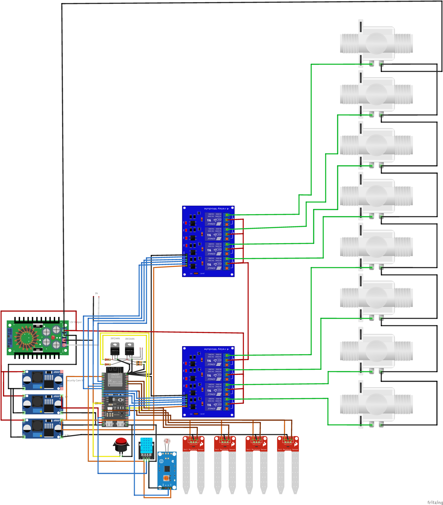

# 🌿 Industrial ESP32 Smart Irrigation & Climate Automation Platform

An industrial-grade, fully integrated smart irrigation and climate automation ecosystem powered by the ESP32. Designed for real-world agricultural, greenhouse, and field applications, this platform unites multi-zone solenoid valve control, digital environmental telemetry, custom 3D CAD/STL hardware enclosures, addressable visual status indicators, and TOTP 2FA security into a unified IoT solution.

  
🔍 Click to View Full Hardware Wiring Diagram

   
  

    
  

---

## 🚀 Overview & System Architecture

Unlike typical hobbyist IoT projects that rely on generic breadboards or basic relay modules, this platform is engineered from the ground up for industrial field reliability, high physical durability, and multi-layered security.

It bridges the gap between low-level hardware control and high-level user accessibility by providing both a responsive Web Control Panel for desktop browsers and a standalone Android application for field operation.

---

## 🌟 Key Features & Capabilities

### 💧 Multi-Zone Solenoid Valve Control
* **8 Independent Relay Channels:** Capable of driving 8 high-power 12V/24V solenoid valves across different irrigation zones (e.g., greenhouses, drip lines, flower beds).
* **Automatic Safety Cutoff Timers:** Features an integrated 30-minute safety timer per relay channel to prevent accidental field flooding or crop damage in the event of network disconnection.

### 📊 Digital Telemetry & Environmental Sensing
* **4-Zone Digital Soil Moisture Monitoring:** Reads digital high/low soil saturation levels to automate watering routines dynamically.
* **Climate Monitoring:** Integrated DHT11 sensor tracks ambient temperature and humidity in real time.
* **Light Intensity Sensing:** Onboard LDR sensor detects sunlight exposure to optimize night/day irrigation scheduling.

### 🔒 Industrial Security (TOTP 2FA)
* **Time-based One-Time Password (2FA):** Implements a Time-based One-Time Password (TOTP) algorithm directly on the ESP32. Sensitive manual overrides, valve toggles, and system settings require valid 2FA authentication via standard mobile authenticator apps (Google Authenticator, Authy).

### 💡 Visual Status Feedback (WLED & Indicators)
* **Addressable WLED Status Lighting:** Utilizes addressable LED strips to provide instant visual diagnostic codes across the enclosure (e.g., active zone indicators, error alerts, standby breathing effects).
* **Enclosure & Panel Lighting:** Auxiliary MOSFET output drivers support high-brightness enclosure LEDs and physical panel status indicators.

---

## 🎨 Custom 3D CAD & Hardware Enclosure Suite

The platform features a complete custom-designed 3D CAD ecosystem stored in the `assets/` directory. All models are optimized for 3D printing (PLA/PETG/TPU) and field deployment:

* **Banana Pi Pro A20 SBC Housing:** Features a hexagonal airflow pattern with active fan mounting to house the central server unit (`cad-bananapi-case-bottom-hex.stl`, `cad-bananapi-case-top-fan.stl`).
* **Soil Sensor Protective Casings:** Weatherproof vertical enclosures with protective top caps designed to shield sensitive electronics from outdoor dirt and moisture (`cad-soil-sensor-casing.stl`, `cad-soil-sensor-cap.stl`).
* **Solenoid Valve Enclosures:** Custom manifold covers equipped with cutouts for status LEDs (`cad-valve-enclosure-main.stl`, `cad-valve-top-cover-led.stl`).
* **Modular Cable Management Boxes:** Junction boxes built for green pluggable terminal blocks to ensure clean wiring and prevent short circuits (`cad-cable-junction-box-large.stl`, `cad-cable-junction-box-small.stl`).
* **Main Panel Chassis:** Heavy-duty internal chassis plate for organized electrical cabinet mounting (`cad-main-mounting-plate.stl`).

---

## 🖥️ User Interfaces & Remote Control

* **Responsive Web Dashboard:** Access real-time sensor graphs, set automated timers, view system logs, and manually trigger valve channels from any desktop or mobile browser.
* **Native Android Application:** Pre-compiled Android APK for quick field control without needing to open a browser.
* **Physical Panel Control:** Includes manual physical button inputs directly on the enclosure for local field operations.

---

## 🛠️ Complete Hardware Wiring & Fritzing Schematic

The hardware layout integrates power regulation, logic isolation, and sensor buses into a clean industrial enclosure:

* **Editable Fritzing Source:** Available at [`assets/hardware-diagram.fzz`](assets/hardware-diagram.fzz).
* **High-Resolution Diagram:** Available at [`assets/hardware-diagram.png`](assets/hardware-diagram.png).

---

## 📖 Complete Technical Setup Guide

For detailed hardware pin mappings, step-by-step firmware compiling, library dependencies, software flashing, and Android APK installation instructions, please refer to our dedicated guide:

➡️ **[View Full Technical Setup & Installation Guide (SETUP.md)](SETUP.md)**

---

## 📄 License

Distributed under the MIT License. See `LICENSE` for more information.
